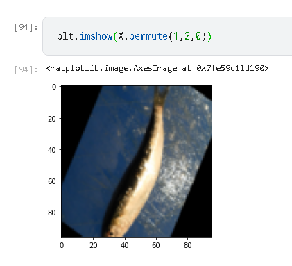
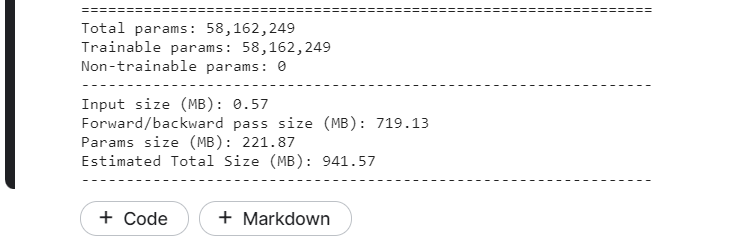

## Classifying fish using Resnet

Getting the dataset from kaggle: 

Amount of gpu required to train a resnet 152 model

https://www.kaggle.com/fanbyprinciple/fish-classification-with-resnet/edit/run/75844548

