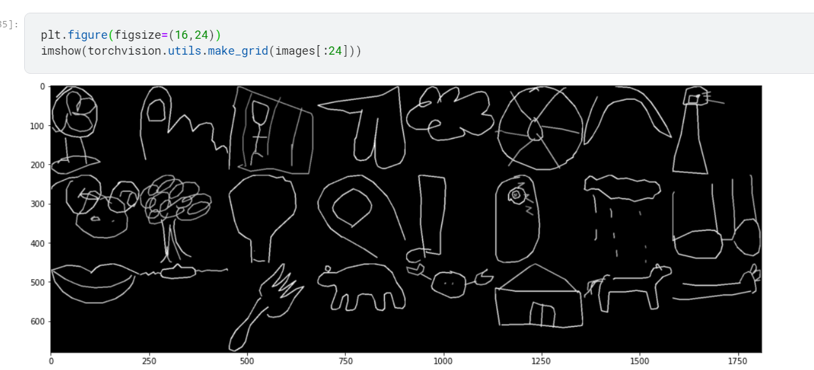
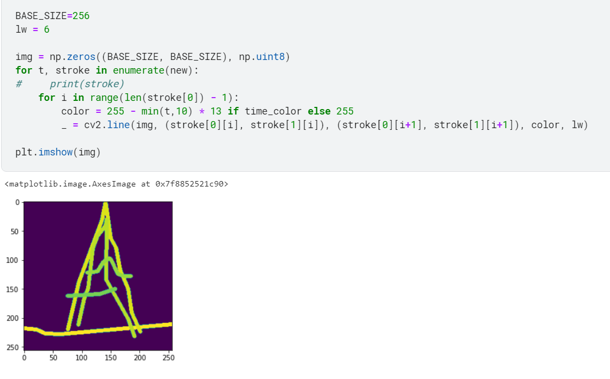

<<<<<<< HEAD
# Trying to access GOOGLE DOODLE data in kaggle

=======
## google doodledataset

https://www.kaggle.com/fanbyprinciple/pytorch/edit

ref: https://www.kaggle.com/leighplt/pytorch-starter-kit

## drawing the dataset

The kernel alos tells us about lr_scheduler so could be important
>>>>>>> 6c82dc33048fadca846f733e55ec9db0c634a169
