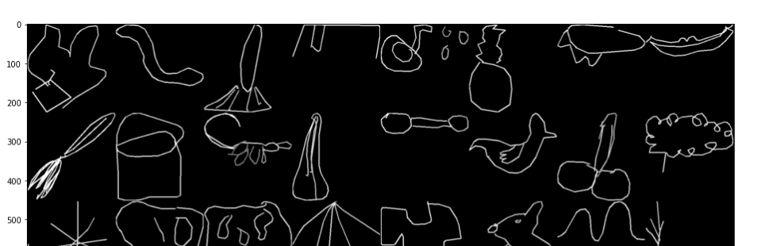
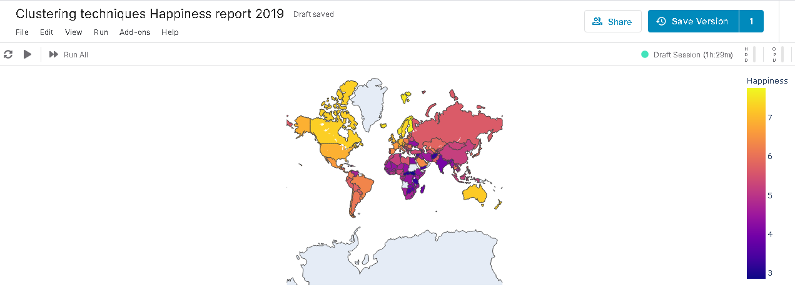
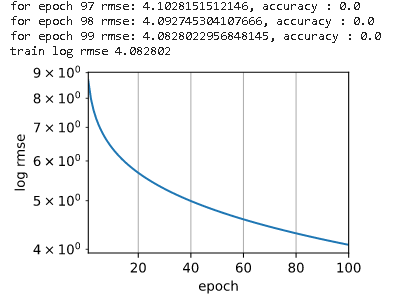
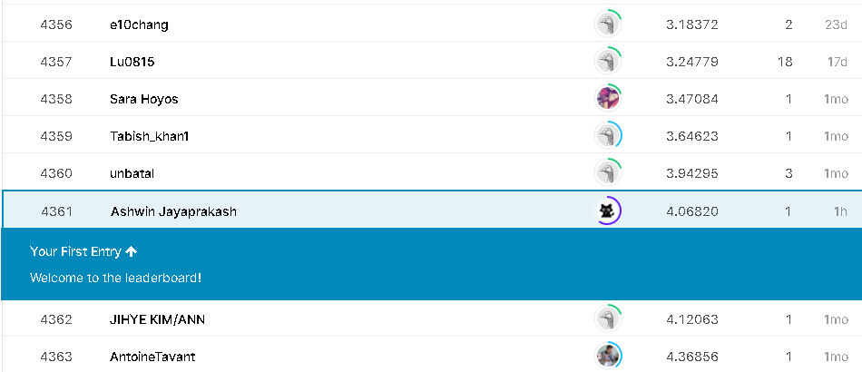

# kaggle_kernels

kaggle.com work dump repo.

Trying to organise my Kaggle work.

## 1. Barcelona database

District database and visualisation.

## 2. google_doodle

Classification and working with a unique dataset.

## 3. happiness_report

Clustering technique.

## 4. Housing prices 

Simple pytorch implementation.

Submission:

Best submission rank: 1K.

## 5. Resnet_implementation

Incomplete:
https://www.kaggle.com/fanbyprinciple/fish-classification-with-resnet

## 6. Weedle_cave

Pokemon dataset

