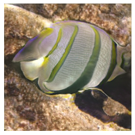

# Trying style gan in colab

with help from https://colab.research.google.com/github/jeffheaton/t81_558_deep_learning/blob/master/t81_558_class_07_3_style_gan.ipynb#scrollTo=3rh5faG6AOFA

Boy with gan

Movie!

